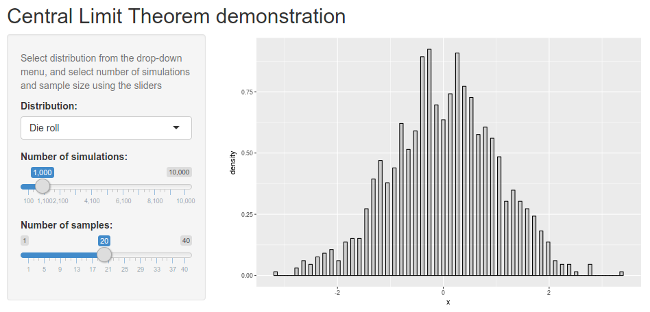

CLT demonstration using Shiny
========================================================
author: Jørgen D. Tyvand
date: March 23, 2018
autosize: true

Overview of the Shiny App
========================================================
incremental: true

I have created a Shiny app to demonstrate the Central Limit Theorem (CLT), namely that the distribution of means of samples or iid random draws (properly normalized) from any distribution tends towards a standard normal distribution as the sample size increases. 

To use the Shiny app, please go to [https://jdtyvand.shinyapps.io/cltdemo/](https://jdtyvand.shinyapps.io/cltdemo/)

The GitHub repo containing the source code for the app and this presentation can be found at [https://www.github.com/JDTyvand/CLTdemo](https://www.github.com/JDTyvand/CLTdemo)

The Central Limit Theorem
========================================================
incremental: true

From the Central Limit Theorem [Wikipedia page](https://en.wikipedia.org/wiki/Central_limit_theorem):

*...For example, suppose that a sample is obtained containing a large number of observations, each observation being randomly generated in a way that does not depend on the values of the other observations, and that the arithmetic average of the observed values is computed. If this procedure is performed many times, the central limit theorem says that the computed values of the average will be distributed according to a normal distribution. A simple example of this is that if one flips a coin many times the probability of getting a given number of heads in a series of flips will approach a normal curve, with mean equal to half the total number of flips in each series. (In the limit of an infinite number of flips, it will equal a normal curve.)*

**Note that for this app we have also normalized the mean of the samples, so the distribution at large sample sizes will be approximately standard normal ($N0, 1)$)**

Shiny App interface
====================================

Using the Shiny App
========================================================
incremental: true

The following choices can be made by the user in the Shiny App 
- The underlying distribution of the samples to be drawn. These include (fair) die rolls, (fair) coin flips, the exponential distribution and the poisson distribution (both with $\lambda$ = 1).
- The number of simulations to be made, i.e. the number of times we draw n samples and take the mean.
- The number of samples in each simulation.
